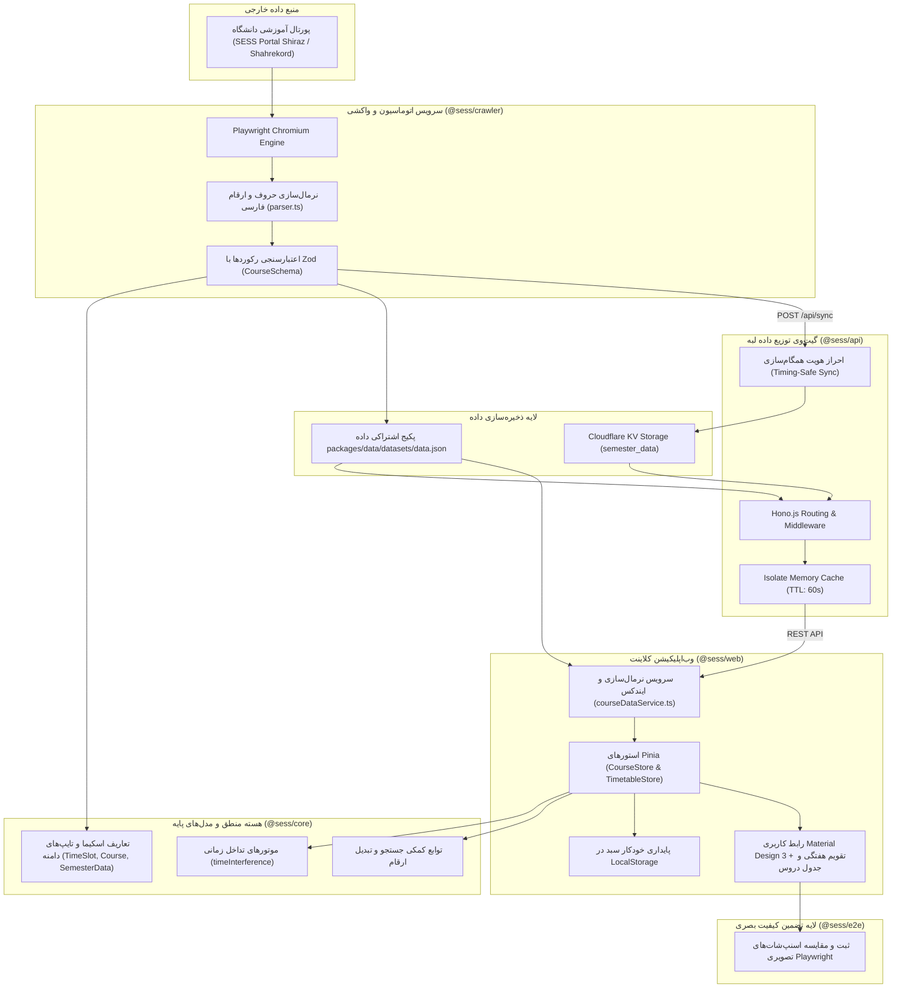

# معماری Core-First در مونوریپو

پروژه **Sess-Timetabling-App** بر پایه فلسفه **معماری Core-First (هسته‌محور)** و ساختار **Monorepo** طراحی شده است. در این الگو، منطق اصلی بیزینس، الگوریتم‌های پردازش زمانی، نرمال‌سازی متون فارسی و اسکیماهای اعتبارسنجی دامنه، کاملاً مستقل از لایه‌های ورودی/خروجی (نظیر مرورگر، فریم‌ورک‌های وب یا ران‌تایم‌های مختلف سرور) در پکیج اشتراکی `@sess/core` نگهداری می‌شوند.

---

## ۱. ساختار پکیج‌ها و ورک‌اسپیس‌ها

مونوریپو با استفاده از **pnpm workspaces** و مدیریت خط لوله کش‌گذاری **Turborepo** سازماندهی شده است:

```text
Sess-Timetabling-App/
├── apps/
│   ├── web/               # فرانت‌اند مدرن Vue 3.5 + Vuetify 3.7 + Pinia 2
│   └── docs/              # پرتال مستندات فنی VitePress 1.6 با تم دو زبانه
├── packages/
│   ├── core/              # هسته محاسباتی خالص، اسکیماهای Zod و الگوریتم‌های تداخل
│   └── api/               # گیت‌وی پرسرعت Hono.js (Cloudflare Workers و Node.js)
├── services/
│   ├── crawler/           # سرویس خزنده پورتال با Playwright و رابط خط فرمان
│   └── e2e/               # سوئیت تست‌های رگرسیون تصویری و خط مبنای بصری
├── server.js              # سرور آماده استقرار Node.js با پشتیبانی از SPA Fallback
├── turbo.json             # خط لوله ساخت موازی و کش هوشمند Turborepo
└── pnpm-workspace.yaml    # پیکربندی ورک‌اسپیس‌های مونوریپو
```

| نقش و مسئولیت در سامانه | پکیج / ماژول | مسیر در مخزن |
| :--- | :--- | :--- |
| فرانت‌اند SPA مدرن بر پایه Vue 3.5، Vuetify 3.7 و استورهای Pinia 2 | `@sess/web` | `apps/web` |
| پورتال جامع مستندات فنی بر پایه VitePress 1.6 و تم دو زبانه | `@sess/docs` | `apps/docs` |
| هسته پردازشی بدون وابستگی، اسکیماهای اعتبارسنجی Zod و موتور تداخل زمانی | `@sess/core` | `packages/core` |
| گیت‌وی پرسرعت Hono.js با پشتیبانی چندهدفه از Cloudflare Workers و Node.js | `@sess/api` | `packages/api` |
| سرویس خزنده و اتوماسیون استخراج اطلاعات پورتال سس با Playwright | `@sess/crawler` | `services/crawler` |
| سوئیت تست‌های رگرسیون بصری و اعتبارسنجی یکپارچه End-to-End | `@sess/e2e` | `services/e2e` |
| سرور مستقل Node.js برای اجرای یکپارچه کلاینت و API در محیط پروداکشن | Runner | `server.js` |
| خط‌لوله ساخت موازی، مدیریت وابستگی‌ها و کش هوشمند Turborepo | Tooling | `turbo.json` |

---

## ۲. دیاگرام جریان سراسری داده (Global Data Flow)

چرخه حیات داده از لحظه استخراج از پورتال‌های دانشگاهی سس تا رندر نهایی در تقویم هفتگی کلاینت به شکل زیر جریان می‌یابد:



---

## ۳. نقش بسته‌ها در معماری Core-First

### ۱. هسته محاسباتی مستقل (`@sess/core`)
* **Pure Logic**: فارغ از هرگونه وابستگی به محیط کلاینت یا سرور.
* **Type-Safety**: تمام داده‌های جریان‌یافته در سیستم با اسکیماهای این بسته ارزیابی و تایپ‌گذاری می‌شوند.
* **Dual Output**: خروجی همزمان ESM و CJS برای پشتیبانی از ابزارهای مختلف جاوااسکریپت و تایپ‌اسکریپت.

### ۲. گیت‌وی ارتباطی چندهدفه (`@sess/api`)
* پیاده‌سازی شده با **Hono.js**.
* قابلیت اجرا روی **Cloudflare Workers** برای دستیابی به تأخیر زیر ۱۰ میلی‌ثانیه در سطح جهان.
* امکان اجرای موازی روی **Node.js** جهت استقرار روی سرورهای محلی، VPS و کانتینرهای داکر.

### ۳. کلاینت واکنش‌گرا و ماژولار (`@sess/web`)
* تفکیک کامل به ماژول‌های فیچر-محور (`courses`, `filters`, `timetable`).
* استفاده از Pinia 2 برای مدیریت وضعیت بهینه بدون نیاز به Watcherهای پرمصرف $O(N^2)$.
* پشتیبانی کامل از زبان طراحی مدرن Material Design 3، حالت‌های Light/Dark و چینش راست‌به‌چپ (RTL).

### ۴. خزنده خودکار اطلاعات (`@sess/crawler`)
* شبیه‌سازی رفتار کاربر در پورتال دانشگاهی با فریم‌ورک Playwright.
* مدیریت خطاهای شبکه و استیل المنت‌ها با مکانیزم‌های تاب‌آوری و تلاش مجدد خودکار.

### ۵. سوئیت اعتبارسنجی بصری (`@sess/e2e`)
* اتوماسیون کامل مرورگر با Playwright و کانال Chromium/Edge جهت رندر و تصویربرداری از ۵ جریان اصلی کاربر.
* تضمین حفظ ۱۰۰٪ ظاهر گرافیکی، تایپوگرافی فارسی و بدون رگرسیون در تمام چرخه‌های به‌روزرسانی.

---

## ۴. مدیریت تسک‌ها و کش‌گذاری هوشمند با Turborepo

خط لوله ساخت و اجرای پروژه‌ها در [turbo.json](file:///e:/Projects/Sess-Timetabling-App/turbo.json) با اتکا به مفهوم «وابستگی‌های بالا به پایین» تعریف شده است:

```jsonc
{
  "$schema": "https://turbo.build/schema.json",
  "tasks": {
    "build": {
      "dependsOn": ["^build"],
      "outputs": ["dist/**", ".vitepress/dist/**"]
    },
    "dev": {
      "cache": false,
      "persistent": true
    },
    "type-check": {
      "dependsOn": ["^build"]
    },
    "test": {
      "dependsOn": ["^build"]
    }
  }
}
```

### مزایای این پیکربندی:
* **تضمین ترتیب کامپایل**: قبل از کامپایل `apps/web` یا `packages/api`، ابتدا به صورت خودکار پکیج پایه‌ای `@sess/core` کامپایل می‌شود.
* **Smart Output Caching**: چنانچه سورس‌کد یک بسته دست‌نخورده باقی مانده باشد، دستور `pnpm build` به جای کامپایل مجدد، خروجی‌های کش‌شده را در کمتر از ۱۰۰ میلی‌ثانیه بازگردانی می‌کند.

---

## ۵. پیش‌نمایش گرافیکی پیاده‌سازی معماری

| ۱. جستجوی پیشرفته و دراور فیلترها | ۲. مشخصات تکمیلی و ظرفیت دروس |
| :---: | :---: |
|  |  |

| ۳. تقویم هفتگی شنبه تا جمعه | ۴. مودال جزئیات درس و سبد واحدها |
| :---: | :---: |
|  |  |

<div align="center">

### ۵. موتور تشخیص هوشمند تداخل دروس و امتحانات


</div>
