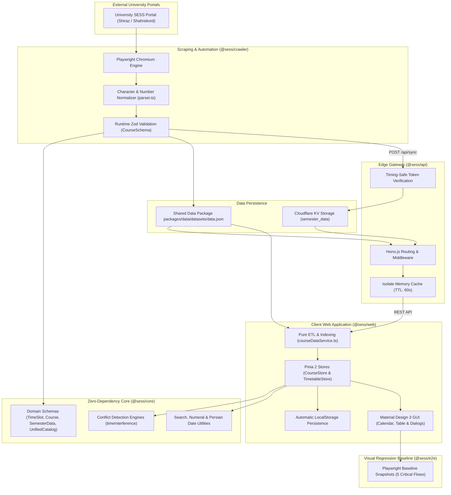

# Core-First Monorepo Architecture

**Sess-Timetabling-App** is engineered around the **Core-First Architecture** paradigm and organized as a high-performance **Monorepo**. In this architectural pattern, core business rules, scheduling conflict formulas, Persian normalizers, and Zod validation schemas reside centrally in `@sess/core`, strictly separated from I/O boundaries such as browsers, frameworks, or cloud runtimes.

---

## 1. Monorepo Structure & Workspaces

The repository is managed using **pnpm workspaces** and orchestrates parallel caching pipelines via **Turborepo**:

```text
Sess-Timetabling-App/
├── apps/
│   ├── web/               # Vue 3.5 + Vuetify 3.7 + Pinia 2 Client SPA
│   └── docs/              # VitePress 1.6 Bilingual Documentation Portal
├── packages/
│   ├── core/              # Zero-dependency TypeScript business engine & Zod schemas
│   └── api/               # Multi-target Hono.js Edge Gateway (Cloudflare & Node)
├── services/
│   ├── crawler/           # Playwright automation crawler & CLI wizard
│   └── e2e/               # Visual regression safety net & snapshot tests
├── server.js              # Standalone Node.js production runner with SPA fallback
├── turbo.json             # Parallel task pipelines & intelligent caching
└── pnpm-workspace.yaml    # Monorepo workspace declarations
```

| Role & Responsibility | Package / Module | Repository Path |
| :--- | :--- | :--- |
| Modern reactive SPA client (Vue 3.5, Vuetify 3.7, Pinia 2) | `@sess/web` | `apps/web` |
| Bilingual technical documentation portal (VitePress 1.6) | `@sess/docs` | `apps/docs` |
| Framework-agnostic core logic, Zod schemas, & conflict formulas | `@sess/core` | `packages/core` |
| Low-latency Hono.js edge API gateway (Cloudflare Workers & Node.js) | `@sess/api` | `packages/api` |
| Automated portal scraping engine & interactive CLI wizard | `@sess/crawler` | `services/crawler` |
| Playwright visual baseline & end-to-end regression test suite | `@sess/e2e` | `services/e2e` |
| Unified Node.js server runner serving API and built web SPA | Runner | `server.js` |
| Task caching and topological dependency execution | Tooling | `turbo.json` |

---

## 2. Global Data Flow Diagram

Data traverses cleanly from external university portals through the crawler, storage, API, and into the client UI:



---

## 3. Package Roles in Core-First Architecture

### 1. Zero-Dependency Core Engine (`@sess/core`)
* **Pure Logic**: Completely free from DOM or server-specific globals.
* **Universal Type-Safety**: All payloads flowing through the ecosystem are validated against its schemas.
* **Dual Bundle Output**: Dual ESM and CJS outputs for modern runtimes and legacy environments alike.

### 2. Multi-Target Edge Gateway (`@sess/api`)
* Developed with **Hono.js**.
* Deploys on **Cloudflare Workers** with sub-10ms response times worldwide.
* Runs concurrently on standalone **Node.js** for self-hosted VPS, intranet, or Docker deployments.

### 3. Modular Client Application (`@sess/web`)
* Organized into domain-driven Feature-First slices (`courses`, `filters`, `timetable`).
* Powered by Pinia 2 stores, replacing costly $O(N^2)$ watchers with reactive Pinia getters.
* Built on Material Design 3 guidelines, dynamic themes, and Persian RTL typography.

### 4. Portal Crawler Service (`@sess/crawler`)
* Simulates human interaction on academic portals using Playwright.
* Recovers transparently from stale element references and network slowdowns using exponential backoffs.

### 5. Visual Regression Suite (`@sess/e2e`)
* Automates Chromium/Edge instances to render and verify 5 critical user flows against pixel-perfect reference baselines.
* Guarantees zero UI regressions across upgrades.

---

## 4. Task Pipelines & Intelligent Caching with Turborepo

Task orchestration in [turbo.json](file:///e:/Projects/Sess-Timetabling-App/turbo.json) leverages topological dependencies:

```jsonc
{
  "$schema": "https://turbo.build/schema.json",
  "tasks": {
    "build": {
      "dependsOn": ["^build"],
      "outputs": ["dist/**", ".vitepress/dist/**"]
    },
    "dev": {
      "cache": false,
      "persistent": true
    },
    "type-check": {
      "dependsOn": ["^build"]
    },
    "test": {
      "dependsOn": ["^build"]
    }
  }
}
```

### Key Architectural Benefits:
* **Guaranteed Compilation Order**: Before building `@sess/web` or `@sess/api`, Turborepo automatically builds the foundational `@sess/core` package.
* **Smart Output Caching**: If package sources remain unchanged, subsequent `pnpm build` calls replay cached outputs in under 100ms.

---

## 5. Visual Showcase of Architectural Implementation

| 1. Advanced Search & Filters | 2. Course Specifications & Capacity |
| :---: | :---: |
|  |  |

| 3. Saturday–Friday Weekly Timetable | 4. Course Details & Selected Units |
| :---: | :---: |
|  |  |

<div align="center">

### 5. Real-Time Clash & Conflict Detection


</div>
