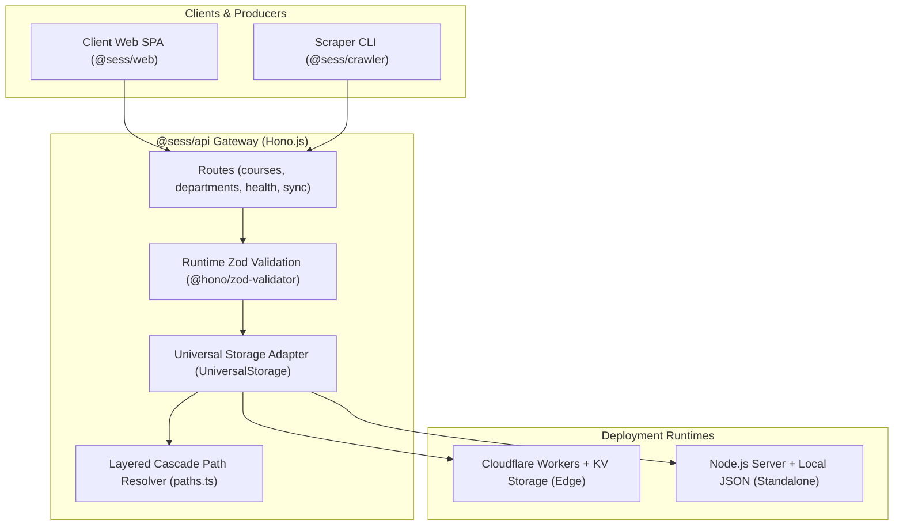
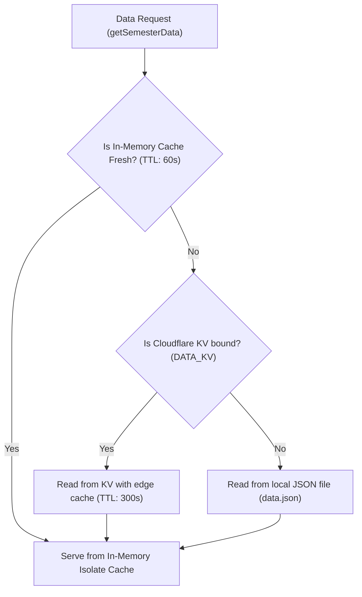

# Edge API Gateway (`@sess/api`)

The `@sess/api` package is a high-performance, edge-first API Gateway built with **Hono.js**. Designed for **multi-target portability**, it executes identically and without code alterations across the global edge network of **Cloudflare Workers** and traditional **Node.js** servers.

---

## 1. Architecture & Capabilities



### Key Technical Capabilities:
1. **Edge Execution (<10ms Response)**: Native Web Fetch API execution without framework overhead.
2. **Universal Storage Abstraction (`storage.ts`)**: Auto-detects **Cloudflare KV** bindings in production or cascades to local `data.json` on Node.js/Docker, backed by a 60-second in-memory Isolate cache.
3. **Layered Cascade Path Resolver (`paths.ts`)**: Deterministically locates static web assets (`apps/web/dist`) and JSON datasets across monorepo workspaces and Docker containers.
4. **Timing-Safe Cryptographic Security (`sync.ts`)**: Performs constant-time token comparisons via Web Crypto API SHA-256 digests and `timingSafeEqual`, preventing timing side-channel attacks.

---

## 2. REST API Reference

All endpoints are mounted under the `/api` prefix.

### 1. Health & Runtime Info (`GET /api/health`)
Provides gateway status, active runtime engine, and timestamp.

* **Response Example:**
```json
{
  "status": "ok",
  "runtime": "cloudflare-workers",
  "timestamp": "2026-09-03T10:45:00.000Z",
  "version": "0.1.0"
}
```

---

### 2. Department Catalog (`GET /api/departments`)
Lists all academic departments present in the semester catalog.

* **Response Example:**
```json
{
  "count": 3,
  "departments": [
    "بخش مهندسی کامپیوتر و فناوری اطلاعات",
    "بخش ریاضی",
    "بخش فیزیک"
  ]
}
```

---

### 3. Search & Filter Courses (`GET /api/courses`)
Fetches courses with multi-dimensional filtering via Query Parameters:
* `department` *(string, optional)*: Filter by offering department name.
* `query` *(string, optional)*: Filter by course title or composite ID.
* `teacher` *(string, optional)*: Filter by instructor name.
* `day` *(string, optional)*: Filter by day or classroom.
* `limit` *(number, optional)*: Maximum number of returned items.

* **Request Example:**
```http
GET /api/courses?department=کامپیوتر&teacher=احمدی&limit=10 HTTP/1.1
```

* **Response Example:**
```json
{
  "count": 1,
  "courses": [
    {
      "id": "290331041^1",
      "title": "طراحی الگوریتم‌ها",
      "vahed": "3",
      "group": "1",
      "teacher": "علی احمدی",
      "gender": "مختلط",
      "unit": "بخش مهندسی کامپیوتر",
      "time_in_week": "شنبه و دوشنبه 10:00 - 12:00",
      "time_room": "شنبه: 10:00-12:00 (کلاس 201)",
      "capacity": "45",
      "final_time": "08:00 - 10:00",
      "final_date": "1403/10/15",
      "final_time_split": { "start_hour": 8, "start_minute": 0, "end_hour": 10, "end_minute": 0 },
      "final_date_split": { "y": 1403, "m": 10, "d": 15 },
      "seperated_time_and_place": [
        {
          "place": "کلاس 201",
          "day": "شنبه",
          "startHour": 10,
          "startMinute": 0,
          "endHour": 12,
          "endMinute": 0
        }
      ]
    }
  ]
}
```

---

### 4. Fetch Course by ID (`GET /api/courses/:id`)
Fetches single course specification by its composite key.

---

### 5. Dataset Synchronization (`POST /api/sync`)
Protected endpoint receiving scraped catalog datasets from `@sess/crawler`.
* **Authentication**: Requires header `Authorization: Bearer <TOKEN>` or `X-Sync-Token: <TOKEN>`.
* **Payload Validation**: Validated against `SemesterDataSchema` via `@sess/core`.

* **Success Response:**
```json
{
  "success": true,
  "message": "Semester dataset synced successfully",
  "stats": {
    "departments": 35,
    "courses": 1420,
    "timestamp": "2026-09-03T10:45:00.000Z"
  }
}
```

---

## 3. Universal Storage Adapter (`storage.ts`)

The storage adapter implements a tiered caching strategy:



1. **In-Memory Isolate Cache**: 60-second TTL cache in Worker/Node memory minimizing KV read operations.
2. **Cloudflare KV Integration**: Persists dataset under `semester_data` key with 5-minute edge cache TTL.
3. **Local File Fallback**: Seamlessly reads/writes to `packages/data/datasets/data.json` during local development or offline execution.

### Layered Cascade Path Resolver (`paths.ts`)
To resolve filesystem paths across varied runtime targets (monorepo dev, standalone runners, or Docker containers), `paths.ts` uses a deterministic tiered cascade:
* `resolveWebDistPath`: Checks `WEB_DIST_PATH` env var first, then workspace root markers (`pnpm-workspace.yaml`), falling back to `apps/web/dist` relative to the current working directory.
* `resolveDataFilePath`: Evaluates `DATA_FILE_PATH` env var first, cascading to canonical `@sess/data` package `packages/data/datasets/data.json`.

---

## 4. Environment Variables & Configuration (.dev.vars / .env)

Configure `.dev.vars` for Cloudflare Wrangler or `.env` for standalone Node.js inside `packages/api/`:

| Variable | Required | Description | Example |
| :--- | :---: | :--- | :--- |
| `SYNC_TOKEN` | Yes (Prod) | Bearer authentication secret for `POST /api/sync` | `"your_strong_secret_token"` |
| `WEB_DIST_PATH` | No | Direct path override to compiled SPA bundle (`apps/web/dist`) | `"/app/apps/web/dist"` |
| `DATA_FILE_PATH` | No | Direct path override to local dataset (`data.json`) | `"/app/packages/data/datasets/data.json"` |
| `PORT` | No | HTTP port for self-hosted Node.js server (Default: 3000) | `3000` |

---

## 5. Development & Deployment

### Local Simulation with Cloudflare Wrangler
```bash
pnpm api:dev
```

### Standalone Node.js Development Server (Watch Mode)
```bash
pnpm --filter @sess/api dev:node
```

### Seed Semester Dataset to Cloudflare KV
```bash
pnpm kv:seed
```

### Production Deployment to Cloudflare Workers
```bash
pnpm --filter @sess/api deploy
```
