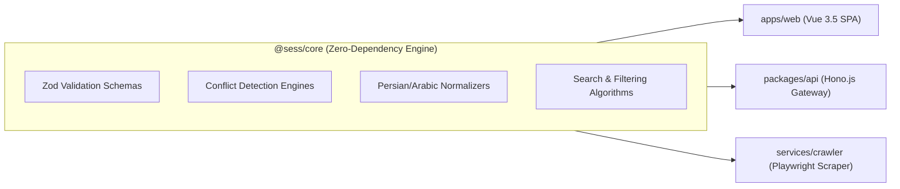

# Shared Core Package (`@sess/core`)

The `@sess/core` package serves as the computational backbone, domain validation layer, and scheduling clash engine of the SESS Timetabling App. Designed as a **pure library** free of browser or server-specific globals, it provides 100% end-to-end type safety powered by **TypeScript 5** and **Zod 3**.

---

## 1. Architecture & Core-First Philosophy

In our **Core-First Monorepo**, `@sess/core` establishes a ubiquitous domain language across all consumers:



### Architectural Pillars:
1. **Single Source of Truth**: All domain entities (`Course`, `TimeSlot`, `SemesterData`) and interference equations reside here. Any schema changes propagate across client, API, and scraper seamlessly.
2. **Zero Runtime Dependencies**: Excluding standard runtime validation with `zod`, the library has zero external dependencies.
3. **Dual ESM/CJS Output**: Compiled concurrently into ES Modules (`.mjs`) and CommonJS (`.js`) via `tsup` for maximum interoperability.

---

## 2. Domain Schemas & Inferred Types

All data payloads entering or leaving the system are parsed and validated via **Zod** at runtime, inferring matching TypeScript types.

### 1. Weekly Class Slot (`TimeSlot`)
Represents an individual scheduled class block occurring during the week:

```typescript
import { z } from "zod";

export const TimeSlotSchema = z.object({
  place: z.string(),                            // Classroom name/number, e.g. "Room 102"
  day: z.string(),                              // Persian day name, e.g. "شنبه"
  startHour: z.number().int().min(0).max(23),   // Class start hour (0-23)
  startMinute: z.number().int().min(0).max(59), // Class start minute (0-59)
  endHour: z.number().int().min(0).max(23),     // Class end hour (0-23)
  endMinute: z.number().int().min(0).max(59),   // Class end minute (0-59)
});

export type TimeSlot = z.infer<typeof TimeSlotSchema>;
```

### 2. Decomposed Final Exam Time & Date
To perform exact numeric comparisons on exam schedules, text fields are parsed into structured integer representations:

```typescript
export const FinalTimeSplitSchema = z.object({
  start_hour: z.number().int().min(0).max(23),
  start_minute: z.number().int().min(0).max(59),
  end_hour: z.number().int().min(0).max(23),
  end_minute: z.number().int().min(0).max(59),
});
export type FinalTimeSplit = z.infer<typeof FinalTimeSplitSchema>;

export const FinalDateSplitSchema = z.object({
  d: z.number().int().min(0), // Jalali day of month
  m: z.number().int().min(0), // Jalali month (1-12)
  y: z.number().int().min(0), // Jalali year (e.g. 1403)
});
export type FinalDateSplit = z.infer<typeof FinalDateSplitSchema>;
```

### 3. Atomic Course Record (`Course`)
The comprehensive course schema mirroring academic portal specifications:

```typescript
export const CourseSchema = z.object({
  id: z.string(),                                      // Composite ID (e.g. "290331041^1")
  title: z.string(),                                   // Course title
  vahed: z.string(),                                   // Credit units as string
  group: z.string(),                                   // Course group number
  teacher: z.string(),                                 // Raw teacher string
  gender: z.string(),                                  // Gender restriction ("مختلط", "برادران", "خواهران")
  unit: z.string(),                                    // Offering department or faculty
  time_in_week: z.string(),                            // Raw weekly time text
  time_room: z.string(),                               // Raw schedule and room text
  midterm_date: z.string(),                            // Midterm exam date
  midterm_time: z.string(),                            // Midterm exam time
  capacity: z.string(),                                // Total student capacity
  final_time: z.string(),                              // Final exam time string
  final_date: z.string(),                              // Final exam date string
  final_time_split: FinalTimeSplitSchema,              // Decomposed exam hour integers
  final_date_split: FinalDateSplitSchema,              // Decomposed exam date integers
  seperated_time_and_place: z.array(TimeSlotSchema),   // Parsed weekly time slots
});

export type Course = z.infer<typeof CourseSchema>;
```

### 4. Semester Catalog Dataset (`SemesterData`)
Two-layer nested dictionary mapping department names to composite course IDs:

```typescript
export const SemesterDataSchema = z.record(
  z.string(), // Department Name
  z.record(
    z.string(), // Course Composite ID
    CourseSchema
  )
);

export type SemesterData = z.infer<typeof SemesterDataSchema>;
```

---

## 3. Conflict Detection Engines

A core feature of the system is the real-time detection of weekly class overlaps and final exam schedule clashes.

### A) Class Time Overlap (`checkClassTimeInterference`)
Compares all weekly time slots between two courses. Returns `true` if an overlap occurs on the same day:

```typescript
import { checkClassTimeInterference } from "@sess/core";

const hasClash = checkClassTimeInterference(courseA, courseB);
```

#### Mathematical Interference Equation:
```text
Overlap = (Day1 == Day2) AND [
            (Start1 < End2 AND End1 > Start2) OR
            (Start1 <= Start2 AND End1 >= End2)
          ]
```

### B) Final Exam Interference (`checkFinalTimeInterference`)
Evaluates exact overlap between final exam dates and hours:

```typescript
import { checkFinalTimeInterference } from "@sess/core";

const hasExamClash = checkFinalTimeInterference(courseA, courseB);
```

> [!NOTE]
> When an exam time is not set in the university portal (defaulting to `00:00 - 00:00`), it is gracefully treated as non-conflicting.

---

## 4. Normalizers & Utility Functions

`@sess/core` provides utilities for Persian/Arabic character normalization, numeral conversion, and text processing:

| Function | Input | Output | Purpose |
| :--- | :--- | :--- | :--- |
| `arabicToPersian(str)` | `string` | `string` | Converts Arabic characters (`ي`, `ك`, Arabic numerals) to Persian |
| `toFarsiNumber(n)` | `number \| string` | `string` | Formats English digits into Persian numerals (`۰...۹`) |
| `convertPersianNumToEng(str)` | `string` | `number` | Fast conversion from Persian numeral strings to JavaScript integers |
| `normalizeDayName(rawDay)` | `string` | `string` | Standardizes Persian day strings with ZWNJ (e.g. `یک‌شنبه`) |
| `teacherNameDivider(raw)` | `string` | `string` | Converts raw portal format (`Last*First*Dept*`) into clean names |
| `teacherSearch(str, options)` | `string, string[]` | `boolean` | Matches teacher names against search filters |
| `placeSearchHelper(places, course)` | `string[], Course` | `boolean` | Verifies course room against requested locations |
| `isTimeInBetween(start, end, slots)` | `string, string, TimeSlot[]` | `boolean` | Checks if weekly slots fall within a selected time window |
| `timeAndPlaceDivider(str)` | `string` | `string[][]` | Deconstructs combined time/location strings into `[time, place]` pairs |
| `timeAndPlaceCorrector(str)` | `string` | `string` | Appends newlines after closing parentheses for clean display |

---

## 5. Usage & Integration

### Workspace Dependency:
Inside `package.json` of any consumer package:
```json
{
  "dependencies": {
    "@sess/core": "workspace:*"
  }
}
```

### TypeScript Example:
```typescript
import {
  CourseSchema,
  checkClassTimeInterference,
  arabicToPersian,
  teacherNameDivider
} from "@sess/core";

// 1. Validate incoming JSON payload
const course = CourseSchema.parse(rawJson);

// 2. Format teacher name for UI presentation
const teacher = teacherNameDivider(course.teacher);

// 3. Test for scheduling interference
const isClashing = checkClassTimeInterference(courseA, courseB);
```

---

## 6. Build & Packaging

The package is bundled using **tsup**:

```bash
# Build dual ESM/CJS bundles
pnpm --filter @sess/core build

# Watch mode during development
pnpm --filter @sess/core dev
```

### Output Files (`dist/`):
* `dist/index.mjs`: Modern ECMAScript Module (ESM)
* `dist/index.js`: CommonJS bundle (CJS)
* `dist/index.d.ts`: TypeScript type definitions
