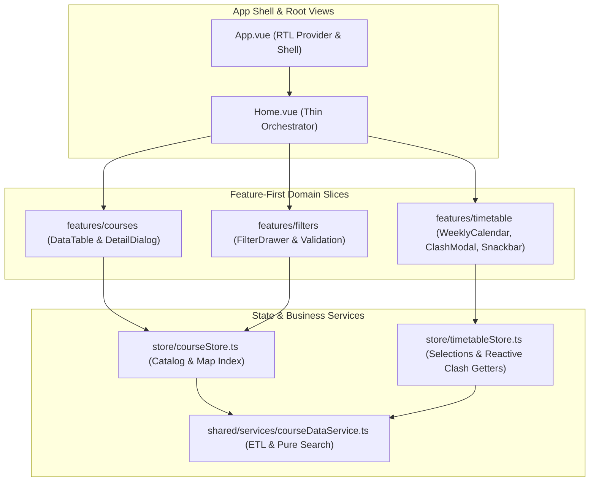

# Modern Web Application (`@sess/web`)

The `@sess/web` package is the user-facing SPA (Single Page Application) frontend of the SESS Timetabling App. It is built with **Vue 3.5**, **Vite 6**, **Vuetify 3.7**, **Pinia 2**, and **TypeScript 5.7**, implementing a modular **Feature-First Architecture** and the **Material Design 3** design system with native RTL support.

---

## 1. Frontend Architecture & Design Principles

During the Phase 5 modernization, the web app was decoupled from a monolithic 1,253-line God-View (`Home.vue`) into clean, single-responsibility feature slices:



### Key Engineering Principles:
1. **Feature-First Organization**: Every domain resides in its dedicated directory (`features/courses`, `features/filters`, `features/timetable`) guarded by public barrel exports (`index.ts`).
2. **Composition API & Strict Typing**: 100% written in `<script setup lang="ts">` with native reactive props destructuring and strongly-typed `defineProps<T>()` and `defineEmits<T>()`.
3. **Immutability & Pure ETL**: Source JSON datasets are never mutated in place; data transformations occur exclusively via pure functions in `courseDataService.ts`.
4. **State Localization**: Ephemeral form state is scoped inside `FilterDrawer.vue` and emitted upward via `SearchEventPayload`, keeping Pinia stores pristine.

---

## 2. Directory Structure & Module Inventory

```text
apps/web/src/
├── assets/                  # CSS tokens (font.css, theme.css)
├── features/
│   ├── courses/             # CourseDataTable.vue, CourseDetailDialog.vue
│   ├── filters/             # FilterDrawer.vue
│   └── timetable/           # WeeklyCalendar.vue, SelectedCoursesTab.vue, ClashAlertModal.vue, ClashSnackbar.vue
├── plugins/
│   └── vuetify.ts           # Material Design 3 theme definitions & RTL configuration
├── router/
│   └── index.ts             # Vue Router 4 configuration (HTML5 History mode)
├── shared/
│   ├── components/          # AppHeader.vue
│   └── services/            # courseDataService.ts
├── store/                   # Pinia 2 domain stores
├── types/                   # Frontend contracts, interfaces, and @sess/core re-exports
└── views/
    └── Home.vue             # Orchestrator page
```

| Feature / Slice | Key Files | Responsibility |
| :--- | :--- | :--- |
| `features/courses` | `CourseDataTable`, `CourseDetailDialog` | Data table with custom expandable rows, pagination, and course modal |
| `features/filters` | `FilterDrawer` | Responsive drawer with 6 autocomplete filters, time pickers, and validation |
| `features/timetable` | `WeeklyCalendar`, `ClashAlertModal` | Persian weekly calendar (Sat-Fri), clash comparison modal & floating snackbar |
| `shared/services` | `courseDataService.ts` | Data normalization ETL pipeline, map indexing, and pure multi-field search |
| `store/` | `courseStore`, `timetableStore` | Domain Pinia state stores with $O(1)$ map index and localStorage persistence |
| `plugins/` | `vuetify.ts` | Material Design 3 tokens, Light/Dark palettes, and RTL setup |

---

## 3. Reactive State Management with Pinia 2

State management is split into two specialized domain stores:

### A) `useCourseStore` (Course Catalog & Indexes)
* Loads and holds the complete semester catalog dataset.
* Builds a fast `Map<string, Course>` index providing $O(1)$ lookups by composite ID.
* Dynamically extracts deduplicated teacher names, departments, courses, and classrooms sorted alphabetically with Persian collation (`Intl.Collator('fa')`).

```typescript
import { defineStore } from 'pinia';
import { processDataset } from '@/shared';

export const useCourseStore = defineStore('courses', {
  state: () => ({
    rawJson: null,
    courseList: [],
    courseMap: new Map(),
    filterOptions: { ... },
    isDataLoaded: false,
  }),
  actions: {
    initCourseData(customData?: unknown) {
      // Normalization and indexing
    }
  }
});
```

### B) `useTimetableStore` (Selections & Reactive Clash Engine)
* Holds user-selected courses (`selectedCourses`).
* **Automatic Persistence**: Automatically syncs with `localStorage` via `pinia-plugin-persistedstate`.
* **Reactive Clash Getters**: Eliminates manual $O(N^2)$ watchers by evaluating conflicts in reactive Pinia getters:
  - `classTimeConflicts`: Computes pairs of courses clashing on weekly class hours.
  - `finalExamConflicts`: Computes pairs of courses clashing on final exam dates/times.
  - `vahedsSum`: Sum of selected credit units with safe Persian numeral parsing.

---

## 4. Pure ETL & Search Service (`courseDataService.ts`)

Located in `shared/services/courseDataService.ts`, all operations are pure functions:

1. **`normalizeCourse(rawCourse, id)`**: Normalizes teacher strings, converts units and groups to Persian numerals, and structures weekly time slots.
2. **`processDataset(rawData)`**: Converts nested department trees into indexed datasets and generates unique filter item lists.
3. **`searchCourses(dataset, filters, timeRange)`**: Multi-criteria search engine (title, teacher, department, gender, location, time window) without memory mutation.

> [!TIP]
> **Tri-State Search Rendering Protocol**:
> * `results.length > 0 && results[0] !== -1`: Displays matching courses in data table.
> * `results[0] === -1`: Explicitly displays "No courses found matching criteria".
> * `results.length === 0`: Initial welcome state guiding the user to start searching.

---

## 5. Visual Design & Material Design 3 Aesthetics

The UI complies with 2026 design standards and Material Design 3 guidelines:

* **Authentic Persian RTL Typography**: Official **Vazirmatn FD** (Farsi Digits across 300–800 weights).
* **Seamless Dark/Light Themes**: Dynamic switching using Vuetify 3 tokens with persistent theme preferences.
* **Responsive Breakpoints**: Evaluated reactively using Vuetify's `useDisplay()` composable (`mobileDevice`).
* **Layered Shadows & Micro-Animations**: Elevation transitions and smooth card hover effects.

### Graphical UI Showcase

| 1. Advanced Search & Filter Drawer | 2. Saturday–Friday Weekly Timetable |
| :---: | :---: |
|  |  |

| 3. Course Specifications & Selected Units | 4. Side-by-Side Conflict Detection Modal |
| :---: | :---: |
|  |  |

---

## 6. Build, Test & Development Commands

```bash
# Start Vite development server (port 8081 with hot reload)
pnpm web:serve

# Run TypeScript and Vue SFC static type-check
pnpm --filter @sess/web type-check

# Run unit tests (ETL, Pinia stores, conflict calculations)
pnpm --filter @sess/web test

# Build optimized production bundle into dist/
pnpm --filter @sess/web build
```
