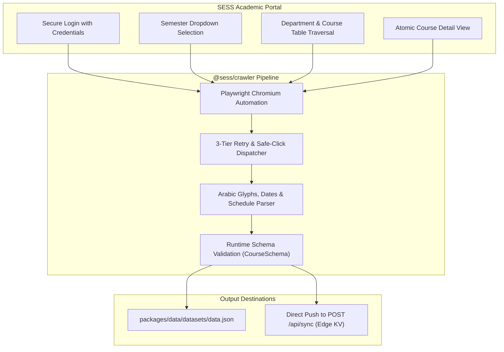

# SESS Portal Crawler Service (`@sess/crawler`)

The `@sess/crawler` service is an automated scraping engine tailored to interface with academic portals based on the SESS platform (**Shiraz University & Shahrekord University**). It logs into portals, traverses semester course offerings, extracts detailed schedules, normalizes Persian text and dates, and validates records against `@sess/core`.

Written in **TypeScript** and powered by **Playwright**, the crawler features both an interactive terminal wizard (`@clack/prompts`) and a headless execution mode for CI/CD pipelines and cron runners.

---

## 1. Architecture & Scraping Pipeline



### Key Technical Features:
1. **Human-like Resilient Automation**: The custom `safeClick` routine blends Playwright click events with native DOM dispatch events, circumventing stale element exceptions on dynamic university dropdowns.
2. **Auto-Recovery & Exponential Backoff**: Automatically handles network latency, connection dropouts, and page timeouts with 3-tier retry policies.
3. **Advanced Parsing Engine (`parser.ts`)**:
   - Standardizes Arabic characters (`ك` to `ک`, `ي` to `ی`) and English numerals.
   - Parses combined schedule strings (e.g. `"شنبه 10:00-12:00 (کلاس 101)"`) into structured `TimeSlot[]` arrays.
   - Deconstructs Jalali exam dates into numeric `FinalDateSplit` and `FinalTimeSplit` representations.
4. **Interactive CLI Wizard (`prompt.ts`)**: Terminal wizard built with `@clack/prompts` guiding semester and department selection.

---

## 2. Environment Configuration

Configure `services/crawler/.env`:

```ini
# SESS portal URL (e.g. Shahrekord or Shiraz University)
SESS_URL=https://sess.sku.ac.ir

# University portal credentials
SESS_USERNAME="s4011000000"
SESS_PASSWORD="your_secure_password"

# Default semester (optional)
SEMESTER="14051"

# Specific departments to scrape (comma-separated, optional)
DEPARTMENTS="مهندسی کامپیوتر,بخش ریاضی,بخش فیزیک"

# Cloud Sync API Configuration (optional)
SYNC_TOKEN=your_strong_api_sync_token
API_URL=https://your-domain.workers.dev/api/sync
```

---

## 3. CLI Usage & Flags

### A) Interactive CLI Wizard
```bash
pnpm crawler:dev
```
Interactively guides you through:
* Semester selection from live portal options.
* Selecting all departments or an individual department.
* Toggling dry-run test mode (first 2 departments).

---

### B) Command Line Flags (Headless & Automation)

```bash
# Scrape a specific department by index in headless mode
pnpm --filter @sess/crawler dev -- -d 32 --headless

# Full scrape of all departments
pnpm --filter @sess/crawler dev -- --all --headless

# Scrape everything headless and output directly into @sess/data package
pnpm --filter @sess/crawler dev -- --all --headless --output ./packages/data/datasets/data.json

# Dry-run mode for selector validation
pnpm --filter @sess/crawler dev -- --dry-run
```

| Flag | Full Option | Type | Description |
| :--- | :--- | :--- | :--- |
| `-d` | `--department <idx>` | Number | Zero-based index of department in dropdown |
| `-s` | `--semester <val>` | String | Semester value code or name (e.g. 4031) |
| `-a` | `--all` | Boolean | Scrape all departments |
| `-b` | `--browser <ch>` | String | Browser channel (`msedge`, `chrome`, or default Playwright Chromium) |
| `-o` | `--output <path>` | Path | Destination path for output `data.json` |
| `--headless` | `--headless` | Boolean | Run browser without graphical window |
| `--sync` | `--sync` | Boolean | Push dataset directly to `/api/sync` |
| `--dry-run` | `--dry-run` | Boolean | Test run on first 2 departments only |

---

## 4. Normalization & Validation Flow (`parser.ts`)

Every extracted row undergoes strict verification:
1. **Raw Form Extraction**: Values extracted from SESS form elements (`edName`, `edTch`, `edTotalUnit`, `edTimeRoom`, etc.).
2. **Text Normalization**: Conversion of Arabic characters, whitespace cleanup, and numeral conversions.
3. **Time Slot Parsing**: `seperateTimeAndPlace` converts weekly schedule strings into structured `TimeSlot[]` arrays.
4. **Zod Runtime Schema Validation**:
   ```typescript
   const parsedCourse = CourseSchema.parse(courseData);
   ```
   If any type mismatch occurs, execution immediately flags the error, preventing corrupt datasets.

---

### Multi-Semester Catalog Export & Cloud Sync (`sync.ts`)
After course extraction finishes:
1. **UnifiedCatalog Packaging**: Courses are organized by semester ID (`--semester` flag or wizard selection) into the `UnifiedCatalog` format with an ISO 8601 `updated_at` timestamp.
2. **Secure Cloud Gateway Push**: `syncToApi` sends the standardized payload alongside `X-Semester` routing headers to `/api/sync`.
3. **Automated Frontend Mirroring**: Datasets saved to `packages/data/datasets/data.json` are automatically mirrored to `apps/web/public/data/data.json`.

---

## 5. Testing & Production Build

### Unit Testing
Run unit tests for normalization, regex matching, and date parsing without launching a browser:
```bash
pnpm --filter @sess/crawler test
```

### Production Build & Execution
```bash
# Compile crawler binary via tsup
pnpm crawler:build

# Execute compiled standalone crawler binary
pnpm crawler:start
```
