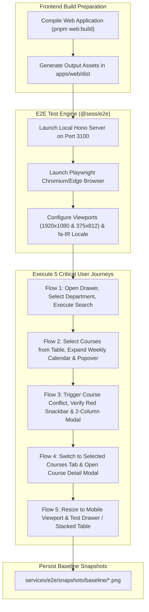

# Visual Regression & E2E Testing (`@sess/e2e`)

The `@sess/e2e` package is the end-to-end visual regression testing suite for the SESS Timetabling App monorepo. Utilizing **Playwright** with Chromium/Edge browser automation, it performs pixel-perfect screenshot captures across critical user journeys, guaranteeing zero regressions in visual layouts, Material Design 3 tokens, component animations, or Persian RTL typography.

---

## 1. Visual Safety Net & Architecture

During architectural refactorings (such as framework migrations or component decoupling), unit tests cannot detect subtle CSS layout shifts, z-index clobbering, or typography rendering bugs. The `@sess/e2e` suite acts as an autonomous visual safety net:



---

## 2. Baseline Snapshots Inventory

Snapshots stored in `services/e2e/snapshots/baseline/` serve as ground-truth references for visual fidelity:

| Snapshot File | Viewport Size | Tested User Scenario |
| :--- | :--- | :--- |
| `01_search_results_desktop.png` | 1920×1080 | Desktop course table, pagination, selected department filters, summary chips |
| `02_calendar_schedule.png` | 1920×1080 | Iranian weekly calendar grid (Sat–Fri), scheduled course cards, slot alignment |
| `02_calendar_event_popover.png` | 1920×1080 | Popover card appearing upon clicking a calendar event block |
| `03_clash_snackbar_and_modal.png` | 1920×1080 | Floating red conflict snackbar and 2-column side-by-side clash comparison modal |
| `04_course_details_modal.png` | 1920×1080 | Full course specification dialog triggered from the selected courses tab |
| `05_mobile_drawer.png` | 375×812 | Responsive mobile navigation drawer on 375px screens |
| `05_mobile_table_stacked.png` | 375×812 | Stacked data cards on mobile viewports eliminating broken horizontal scrolling |

---

## 3. Automation Script Mechanics (`capture_baseline.ts`)

1. **Build Verification**: Ensures `apps/web/dist/index.html` exists using `resolveWebDistPath()`.
2. **Production Server Spin-up**: Launches an isolated Hono.js HTTP server on test port 3100.
3. **Browser Channel Selection**: Automates `msedge` or system Chromium with native `fa-IR` locale.
4. **Realistic User Simulation**: Executes natural keystrokes, dropdown selects, and modal transitions with hydration pauses.
5. **Safe Teardown**: Captures PNG snapshots and gracefully closes both browser and server instances.

---

## 4. Running the Visual Tests

> [!IMPORTANT]
> The web application must be compiled before executing the baseline capture:
> ```bash
> pnpm web:build
> ```

```bash
# Capture and verify baseline snapshots
pnpm e2e:baseline

# Or via package filter:
pnpm --filter @sess/e2e test
```

---

## 5. Regression Analysis

* Any visual deviations in colors, padding, fonts, or component dimensions immediately show up against the reference baseline PNGs.
* This suite guaranteed 100% layout and visual preservation throughout the migration from Vue 2 to Vue 3.5 and Vuetify 3.
