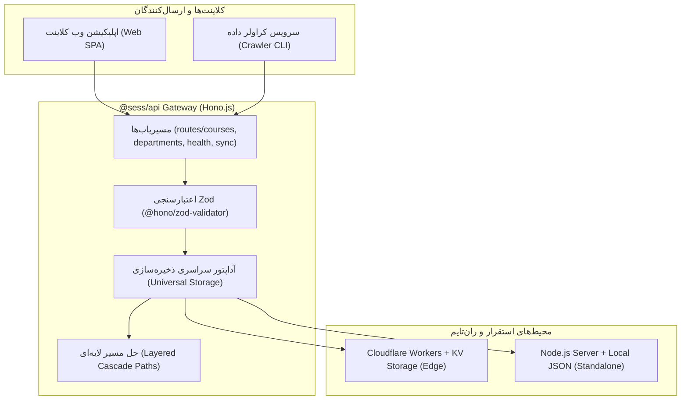
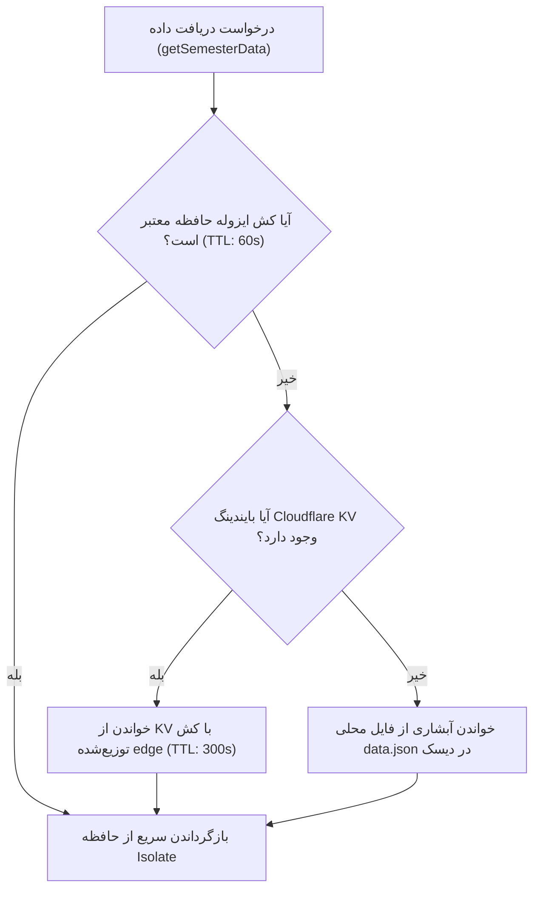

# گیت‌وی API لبه (`@sess/api`)

پکیج `@sess/api` لایه واسط ارتباطی (API Gateway) پرسرعت و بهینه‌سازی‌شده برای محاسبات لبه (Edge Computing) است. این ماژول با فریم‌ورک استاندارد وب **Hono.js** پیاده‌سازی شده و از قابلیت **قابلیت حمل چندهدفه (Multi-Target Portability)** بهره می‌برد؛ بدین معنا که بدون هیچ تغییری در کدهای سورس، هم بر بستر شبکه جهانی سرورهای ابری **Cloudflare Workers** و هم در محیط سنتی سرورهای **Node.js** با نهایت بازدهی اجرا می‌شود.

---

## ۱. اهداف و جایگاه معماری (Architecture & Capabilities)



### ویژگی‌های شاخص فنی:
1. **Edge Execution (<10ms Response)**: اجرای سریع بر پایه استانداردهای Web Fetch API بدون سربار فریم‌ورک‌های سنگین.
2. **Universal Storage Abstraction (`storage.ts`)**: تشخیص هوشمند اتصال به **Cloudflare KV** در لبه یا خواندن/نوشتن فایل محلی `data.json` در سرورهای محلی یا تست.
3. **Layered Cascade Path Resolver (`paths.ts`)**: الگوریتم حل مسیر چندلایه‌ای برای تعیین دقیق مسیر فایل‌های استاتیک کلاینت (`apps/web/dist`) و دیتابیس در محیط‌های مونوریپو و ایمیج‌های داکر.
4. **Zero-Side-Channel Security (`sync.ts`)**: مقایسه توکن‌های امنیتی ادمین با استفاده از الگوریتم مقاوم در برابر حملات تحلیل زمانی (Timing-Safe Comparison با SHA-256 و Web Crypto).

---

## ۲. مشخصات و اندپوینت‌های API (REST Endpoints)

همه اندپوینت‌ها تحت پیش‌وند `/api` سرویس‌دهی می‌کنند.

### ۱. وضعیت سلامت سرور (`GET /api/health`)
جهت بررسی کارکرد گیت‌وی و تشخیص نوع ران‌تایم فعال (کلودفلر یا نودجی‌اس).

* **نمونه پاسخ:**
```json
{
  "status": "ok",
  "runtime": "cloudflare-workers",
  "timestamp": "2026-08-28T14:30:00.000Z",
  "version": "0.1.0"
}
```

---

### ۲. فهرست دپارتمان‌ها و دانشکده‌ها (`GET /api/departments`)
لیستی از تمامی دپارتمان‌ها و واحدهای آموزشی موجود در کاتالوگ درسی را برمی‌گرداند.

* **نمونه پاسخ:**
```json
{
  "count": 3,
  "departments": [
    "بخش مهندسی کامپیوتر و فناوری اطلاعات",
    "بخش ریاضی",
    "بخش فیزیک"
  ]
}
```

---

### ۳. جستجو و فیلتر دروس (`GET /api/courses`)
دریافت لیست دروس ارائه‌شده با قابلیت فیلترهای چندگانه از طریق Query Parameters.

* **پارامترهای جستجو (Query Parameters):**
  * `department` (اختیاری): فیلتر بر اساس نام دانشکده/بخش.
  * `query` (اختیاری): جستجو در عنوان درس یا شناسه عددی درس.
  * `teacher` (اختیاری): نام استاد ارائه دهنده.
  * `day` (اختیاری): روز برگزاری در طول هفته.
  * `limit` (اختیاری): تعداد حداکثر رکوردهای بازگشتی.

* **نمونه درخواست:**
```http
GET /api/courses?department=کامپیوتر&teacher=احمدی&limit=10 HTTP/1.1
```

* **نمونه پاسخ:**
```json
{
  "count": 1,
  "courses": [
    {
      "id": "290331041^1",
      "title": "طراحی الگوریتم‌ها",
      "vahed": "3",
      "group": "1",
      "teacher": "علی احمدی",
      "gender": "مختلط",
      "unit": "بخش مهندسی کامپیوتر",
      "time_in_week": "شنبه و دوشنبه 10:00 - 12:00",
      "time_room": "شنبه: 10:00-12:00 (کلاس 201)",
      "capacity": "45",
      "final_time": "08:00 - 10:00",
      "final_date": "1403/10/15",
      "final_time_split": { "start_hour": 8, "start_minute": 0, "end_hour": 10, "end_minute": 0 },
      "final_date_split": { "y": 1403, "m": 10, "d": 15 },
      "seperated_time_and_place": [
        {
          "place": "کلاس 201",
          "day": "شنبه",
          "startHour": 10,
          "startMinute": 0,
          "endHour": 12,
          "endMinute": 0
        }
      ]
    }
  ]
}
```

---

### ۴. دریافت مشخصات یک درس با شناسه (`GET /api/courses/:id`)
* **نمونه درخواست:**
```http
GET /api/courses/290331041^1 HTTP/1.1
```

---

### ۵. هماهنگ‌سازی دیتاست ترم تحصیلی (`POST /api/sync`)
اندپوینت اختصاصی جهت دریافت داده‌های استخراج‌شده از کراولر پورتال و ثبت در پایگاه‌داده.

* **احراز هویت:** ارسال کلید اختصاصی در هدر `Authorization: Bearer <TOKEN>` یا هدر `X-Sync-Token: <TOKEN>`.
* **اعتبارسنجی بدنه (Body):** ساختار کامل `SemesterDataSchema` بر پایه هسته Zod.

* **نمونه پاسخ موفق:**
```json
{
  "success": true,
  "message": "Semester dataset synced successfully",
  "stats": {
    "departments": 35,
    "courses": 1420,
    "timestamp": "2026-08-28T15:00:00.000Z"
  }
}
```

---

## ۳. لایه ذخیره‌سازی یکپارچه (`storage.ts`)

آداپتور داده از یک استراتژی هوشمند چندسطحی برای کش و ماندگاری داده‌ها بهره می‌برد:



1. **In-Memory Isolate Cache**: کش موقت در سطح حافظه رم با طول عمر ۶۰ ثانیه به منظور کاهش چشمگیر درخواست‌های مکرر به KV و دیسک.
2. **Cloudflare KV Integration**: ذخیره کاتالوگ تحت کلید `semester_data` با زمان حیات کش لبه (Edge Cache TTL) به مدت ۵ دقیقه.
3. **Failover Filesystem**: در صورت عدم اتصال به کلودفلر یا بروز خطا، داده‌ها از فایل‌های فیزیکی دیسک فراخوانی و ذخیره می‌شوند.

### حل‌کننده آبشاری مسیرها (`paths.ts`)
جهت تعیین مسیرهای دیسک در شرایط مختلف استقرار (Monorepo، داکر یا سرور مجزا)، ماژول `paths.ts` از الگوریتم آبشاری چندسطحی بهره می‌برد:
* `resolveWebDistPath`: ابتدا مقدار متغیر محیطی `WEB_DIST_PATH` را چک کرده، سپس نشانگرهای ریشه مونو‌ریپو (`pnpm-workspace.yaml`) را بررسی نموده و در نهایت به پوشه `apps/web/dist` نسبت به دایرکتوری جاری اشاره می‌کند.
* `resolveDataFilePath`: با اولویت متغیر `DATA_FILE_PATH` یا مسیر آبشاری به فایل کانونیکال پکیج داده `packages/data/datasets/data.json`.

---

## ۴. متغیرهای محیطی و تنظیمات (.dev.vars / .env)

برای اجرای محلی با Wrangler فایل `.dev.vars` و برای اجرای مستقل سرور Node.js فایل `.env` را در `packages/api/` تنظیم کنید:

| متغیر محیطی | الزامی | شرح و کاربرد | نمونه مقدار |
| :--- | :---: | :--- | :--- |
| `SYNC_TOKEN` | بله (پروداکشن) | کلید امنیتی احراز هویت برای اندپوینت `POST /api/sync` | `"your_strong_secret_token"` |
| `WEB_DIST_PATH` | خیر | مسیر مستقیم دایرکتوری فایل‌های کامپایل‌شده وب (`apps/web/dist`) | `"/app/apps/web/dist"` |
| `DATA_FILE_PATH` | خیر | مسیر مستقیم فایل کاتالوگ دروس محلی (`data.json`) | `"/app/packages/data/datasets/data.json"` |
| `PORT` | خیر | پورت شنود سرور اختصاصی Node.js (پیش‌فرض: ۳۰۰۰) | `3000` |

---

## ۵. راه‌اندازی، اجرا و استقرار

### اجرای محیط شبیه‌ساز Cloudflare با Wrangler
```bash
pnpm api:dev
```

### اجرای مستقل بر روی سرور Node.js (حالت واچ)
```bash
pnpm --filter @sess/api dev:node
```

### بارگذاری اولیه داده‌ها در فضای Cloudflare KV
```bash
pnpm kv:seed
```

### استقرار مستقیم بر روی سرورهای جهانی کلودفلر
```bash
pnpm --filter @sess/api deploy
```
