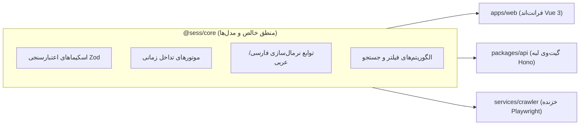

# هسته پردازشی (`@sess/core`)

پکیج `@sess/core` ستون فقرات بیزینس لاجیک (Business Logic)، اسکیماهای اعتبارسنجی دامنه و موتورهای پردازش تداخل‌های زمانی سامانه SESS است. این پکیج به صورت **کامپوننت خالص (Pure Library)**، مستقل از هرگونه وابستگی به محیط اجرا (بدون وابستگی به DOM مرورگر یا APIهای اختصاصی Node.js) و با تایپ‌سیفتی ۱۰۰٪ بر پایه **TypeScript 5** و **Zod 3** طراحی شده است.

---

## ۱. اهداف و جایگاه معماری (Architecture & Purpose)

در ساختار **Core-First Monorepo**، پکیج `@sess/core` نقش تعریف‌کننده «زبان مشترک» بین کلاینت، سرور و کراولر را دارد.



### مزایای معماری:
1. **Single Source of Truth (مرجع واحد حقیقت)**: هرگونه تغییر در ساختار داده‌های درسی یا قوانین تداخل تنها در یک نقطه اعمال شده و بلافاصله در کل اکوسیستم بازتاب می‌یابد.
2. **Zero Runtime Dependencies**: به جز کتابخانه استاندارد `zod` برای اعتبارسنجی در زمان اجرا، این بسته فاقد هرگونه وابستگی سنگین خارجی است.
3. **Dual ESM/CJS Output**: کامپایل همزمان به دو ماژول باینری مدرن `ESM` و سنتی `CommonJS` برای سازگاری حداکثری با ران‌تایم‌های مختلف.

---

## ۲. مدل‌های داده و اسکیماهای اعتبارسنجی (Domain Schemas)

تمام ورودی‌ها و خروجی‌های سیستم به کمک **Zod** در زمان اجرا اعتبارسنجی شده و تایپ‌های هم‌نام TypeScript از آن‌ها استخراج (Infer) می‌شوند.

### ۱. بازه زمانی هفتگی (`TimeSlot`)
هر درس ارائه‌شده در طول هفته می‌تواند دارای یک یا چند بازه زمانی برگزاری (مثلاً شنبه‌ها و دوشنبه‌ها ساعت ۸ تا ۱۰) باشد:

```typescript
import { z } from "zod";

export const TimeSlotSchema = z.object({
  place: z.string(),                            // مکان یا شماره کلاس، مثلاً "اتاق 102"
  day: z.string(),                              // نام روز هفته به فارسی، مثلاً "شنبه"
  startHour: z.number().int().min(0).max(23),   // ساعت شروع (0 تا 23)
  startMinute: z.number().int().min(0).max(59), // دقیقه شروع (0 تا 59)
  endHour: z.number().int().min(0).max(23),     // ساعت پایان (0 تا 23)
  endMinute: z.number().int().min(0).max(59),   // دقیقه پایان (0 تا 59)
});

export type TimeSlot = z.infer<typeof TimeSlotSchema>;
```

### ۲. زمان و تاریخ تفکیک‌شده امتحان پایان‌ترم
برای مقایسه ریاضی و کامپیوتری زمان امتحانات پایان‌ترم، رشته‌های متنی به ساختارهای عددی تفکیک می‌شوند:

```typescript
export const FinalTimeSplitSchema = z.object({
  start_hour: z.number().int().min(0).max(23),
  start_minute: z.number().int().min(0).max(59),
  end_hour: z.number().int().min(0).max(23),
  end_minute: z.number().int().min(0).max(59),
});
export type FinalTimeSplit = z.infer<typeof FinalTimeSplitSchema>;

export const FinalDateSplitSchema = z.object({
  d: z.number().int().min(0), // روز ماه شمسی
  m: z.number().int().min(0), // ماه شمسی (1 تا 12)
  y: z.number().int().min(0), // سال شمسی (مثلاً 1403)
});
export type FinalDateSplit = z.infer<typeof FinalDateSplitSchema>;
```

### ۳. مشخصات کامل درس (`Course`)
رکورد اتمیک کامل یک درس ارائه‌شده در پورتال سس:

```typescript
export const CourseSchema = z.object({
  id: z.string(),                                      // شناسه ترکیبی و یکتا (مثلاً "290331041^1")
  title: z.string(),                                   // عنوان درس
  vahed: z.string(),                                   // تعداد واحد درس به‌صورت رشته عددی
  group: z.string(),                                   // شماره گروه ارائه
  teacher: z.string(),                                 // رشته نام اساتید (فرمت سس)
  gender: z.string(),                                  // جنسیت مجاز ("مختلط"، "برادران"، "خواهران")
  unit: z.string(),                                    // نام بخش یا دانشکده ارائه‌دهنده
  time_in_week: z.string(),                            // متن خام زمان‌بندی هفتگی
  time_room: z.string(),                               // متن خام زمان و مکان
  midterm_date: z.string(),                            // تاریخ امتحان میان‌ترم
  midterm_time: z.string(),                            // ساعت امتحان میان‌ترم
  capacity: z.string(),                                // ظرفیت کل کلاس
  final_time: z.string(),                              // متن ساعت امتحان پایان‌ترم
  final_date: z.string(),                              // متن تاریخ امتحان پایان‌ترم
  final_time_split: FinalTimeSplitSchema,              // ساعت تجزیه‌شده امتحان
  final_date_split: FinalDateSplitSchema,              // تاریخ تجزیه‌شده امتحان
  seperated_time_and_place: z.array(TimeSlotSchema),   // آرایه بازه‌های زمانی هفتگی
});

export type Course = z.infer<typeof CourseSchema>;
```

### ۴. کاتالوگ جامع ترم تحصیلی (`SemesterData`)
ساختار دیکشنری دو لایه از دپارتمان‌ها و دروس که در فایل `data.json` یا دیتابیس لبه ذخیره می‌شود:

```typescript
export const SemesterDataSchema = z.record(
  z.string(), // نام دپارتمان / دانشکده (Department Name)
  z.record(
    z.string(), // شناسه درس (Composite Course ID)
    CourseSchema
  )
);

export type SemesterData = z.infer<typeof SemesterDataSchema>;
```

---

## ۳. موتور تشخیص تداخل‌های زمانی (Conflict Detection Engines)

یکی از قابلیت‌های کلیدی سیستم، شناسایی بلادرنگ هم‌پوشانی زمانی کلاس‌ها و امتحانات پایان‌ترم است.

### الف) تداخل ساعت برگزاری کلاس‌های هفتگی (`checkClassTimeInterference`)

این تابع با دریافت دو آبجکت `Course`، تمام اسلات‌های هفتگی آن‌ها را مقایسه کرده و در صورت وجود هم‌پوشانی زمانی در روز یکسان، مقدار `true` برمی‌گرداند.

```typescript
import { checkClassTimeInterference } from "@sess/core";

const hasClash = checkClassTimeInterference(courseA, courseB);
if (hasClash) {
  // اطلاع‌رسانی تداخل کلاسی به کاربر
}
```

#### الگوریتم ریاضی تداخل:
ابتدا فضاهای خالی نام روزها حذف شده و در صورت تطابق روز، بازه‌های زمانی با شرط بازه پیوسته سنجیده می‌شوند:
```text
تداخل زمانی = (روز اول == روز دوم) و
               [ (شروع اول < پایان دوم  و  پایان اول > شروع دوم)  یا
                 (شروع اول <= شروع دوم  و  پایان اول >= پایان دوم) ]
```

### ب) تداخل زمان آزمون پایان‌ترم (`checkFinalTimeInterference`)

بررسی هم‌زمانی دقیق روز و ساعت امتحان دو درس بر اساس تقویم امتحانات:

```typescript
import { checkFinalTimeInterference } from "@sess/core";

const hasExamClash = checkFinalTimeInterference(courseA, courseB);
```

> [!NOTE]
> در صورتی که زمان امتحان پایان‌ترم درسی در سامانه مشخص نشده باشد (مقادیر ساعت معادل `00:00 - 00:00`)، به عنوان تداخل در نظر گرفته نمی‌شود تا انتخاب واحد کاربر مسدود نگردد.

---

## ۴. توابع کاربردی و نرمال‌سازی (Helper Functions)

پکیج `@sess/core` ابزارهای مستقلی برای تمیزکاری رشته‌های متن فارسی و استخراج داده‌ها ارائه می‌دهد:

| تابع | ورودی | خروجی | کاربرد |
| :--- | :--- | :--- | :--- |
| `arabicToPersian(str)` | `string` | `string` | تبدیل کاراکترهای عربی (ي، ك، ارقام عربی) به حروف و ارقام استاندارد فارسی |
| `toFarsiNumber(n)` | `number \| string` | `string` | تبدیل ارقام انگلیسی به ارقام فارسی جهت نمایش در UI |
| `convertPersianNumToEng(str)` | `string` | `number` | تبدیل امن رشته‌های حاوی ارقام فارسی به مقادیر عددی صحیح (Integer) |
| `normalizeDayName(rawDay)` | `string` | `string` | استانداردسازی نام روزهای هفته فارسی با نیم‌فاصله (مانند «یک‌شنبه») |
| `teacherNameDivider(raw)` | `string` | `string` | تبدیل فرمت خام سس (`فامیلی*نام*دانشکده*`) به نام خوانا (`نام فامیلی`) |
| `teacherSearch(str, options)` | `string, string[]` | `boolean` | بررسی تطابق نام استاد با فیلترهای انتخابی کاربر |
| `placeSearchHelper(places, course)` | `string[], Course` | `boolean` | جستجوی مکان برگزاری در اسلات‌های درسی |
| `isTimeInBetween(start, end, slots)` | `string, string, TimeSlot[]` | `boolean` | بررسی قرارگیری کامل ساعات کلاس در بازه فیلتر زمانی کاربر |
| `timeAndPlaceDivider(str)` | `string` | `string[][]` | تقطیع رشته ترکیبی زمان و مکان کلاس‌ها به جفت‌های تفکیک‌شده |
| `timeAndPlaceCorrector(str)` | `string` | `string` | افزودن شکست خط (Newline) پس از پرانتزهای بسته جهت خوانایی بهتر |

---

## ۵. راهنمای استفاده و نصب (Usage Guide)

### فراخوانی در ورک‌اسپیس‌های مونوریپو:

در `package.json` هر بسته کلاینت یا سرور:

```json
{
  "dependencies": {
    "@sess/core": "workspace:*"
  }
}
```

### نمونه استفاده عملی در کدهای TypeScript:

```typescript
import {
  CourseSchema,
  checkClassTimeInterference,
  arabicToPersian,
  teacherNameDivider
} from "@sess/core";

// ۱. اعتبارسنجی داده خام
const parsedCourse = CourseSchema.parse(rawJson);

// ۲. تبدیل نام استاد به فرمت نمایشی
const teacherName = teacherNameDivider(parsedCourse.teacher);

// ۳. بررسی تداخل
const isClashing = checkClassTimeInterference(course1, course2);
```

---

## ۶. فرآیند ساخت و کامپایل (Build Configuration)

کامپایل این بسته توسط باندلر مدرن **tsup** انجام می‌پذیرد:

```bash
# کامپایل مستقل بسته
pnpm --filter @sess/core build

# حالت توسعه و تماشای تغییرات (Watch Mode)
pnpm --filter @sess/core dev
```

فایل‌های خروجی در شاخه `dist/` به صورت زیر توزیع می‌شوند:
* `dist/index.mjs`: باندل مدرن ECMAScript Module
* `dist/index.js`: باندل پشتیبان CommonJS
* `dist/index.d.ts`: تعاریف کامل تایپ‌های TypeScript
