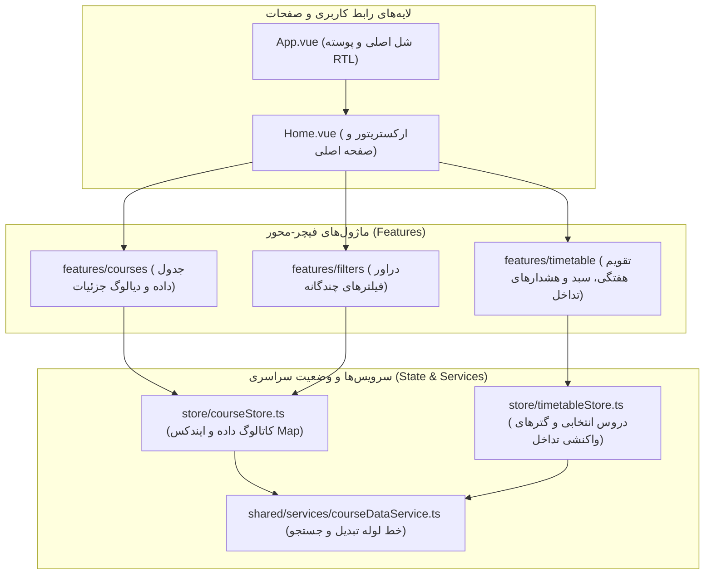

# وب‌اپلیکیشن کلاینت (`@sess/web`)

پکیج `@sess/web` فرانت‌اند SPA (Single Page Application) سامانه سس است که بر پایه **Vue 3.5**, **Vite 6**, **Vuetify 3.7**, **Pinia 2** و **TypeScript 5.7** با معماری فیچر-محور (Feature-First) و زبان طراحی مدرن **Material Design 3** توسعه یافته است.

---

## ۱. اهداف و معماری فرانت‌اند (Frontend Architecture)

در جریان نوسازی فاز ۵، این وب‌اپلیکیشن از معماری سنتی تک‌فایلی (God-View) به ساختار کاملاً ماژولار و تفکیک‌شده بر اساس دامنه‌های مستقل (Domain-Driven Slices) بازنویسی شد.



### اصول کلیدی توسعه کلاینت:
1. **Feature-First Architecture**: هر دامنه دارای پوشه اختصاصی، کامپوننت‌های مجزا و یک فایل ورودی عمومی `index.ts` (Public Barrel Export) است. وارد کردن فایل‌های داخلی از خارج ماژول توسط ESLint ممنوع است.
2. **Composition API & Strict TypeScript**: استفاده ۱۰۰٪ از سینتکس `<script setup lang="ts">` با تخریب واکنشی پروپ‌ها (Reactive Props Destructuring) و تایپ‌های قوی `defineProps<T>()` و `defineEmits<T>()`.
3. **Data Immutability & Pure ETL**: تمام تغییرات ساختاری و نرمال‌سازی‌ها در لایه سرویس `courseDataService` به صورت توابع خالص (Pure Functions) انجام شده و دیتای خام تغییر داده نمی‌شود.
4. **State Localization**: استیت‌های موقت فرم فیلترها درون کامپوننت `FilterDrawer.vue` نگهداری شده و از آلودگی استورهای سراسری جلوگیری می‌شود.

---

## ۲. ساختار دایرکتوری و ماژول‌ها

```text
apps/web/src/
├── assets/
│   ├── font.css
│   └── theme.css
├── features/
│   ├── courses/
│   │   ├── components/
│   │   │   ├── CourseDataTable.vue
│   │   │   └── CourseDetailDialog.vue
│   │   └── index.ts
│   ├── filters/
│   │   ├── components/
│   │   │   └── FilterDrawer.vue
│   │   └── index.ts
│   └── timetable/
│       ├── components/
│       │   ├── WeeklyCalendar.vue
│       │   ├── SelectedCoursesTab.vue
│       │   ├── ClashAlertModal.vue
│       │   └── ClashSnackbar.vue
│       └── index.ts
├── plugins/
│   └── vuetify.ts
├── router/
│   └── index.ts
├── shared/
│   ├── components/
│   │   └── AppHeader.vue
│   ├── services/
│   │   └── courseDataService.ts
│   └── index.ts
├── store/
│   ├── courseStore.ts
│   ├── timetableStore.ts
│   └── index.ts
├── types/
│   └── index.ts
└── views/
    └── Home.vue
```

| شرح وظایف و نقش در معماری Feature-First | فایل‌های کلیدی | دایرکتوری / ماژول |
| :--- | :--- | :--- |
| جدول اصلی اطلاعات دروس، نمایش ردیف‌های بازشونده و دیالوگ تفصیلی مشخصات | `CourseDataTable`, `CourseDetailDialog` | `features/courses` |
| دراور کشویی فیلترهای چندگانه (دانشکده، استاد، جنسیت، ساعت و روز) | `FilterDrawer` | `features/filters` |
| تقویم هفتگی ایرانی (شنبه-جمعه)، کارت‌های انتخابی و مودال مقایسه تداخل | `WeeklyCalendar`, `ClashAlertModal` | `features/timetable` |
| پایپ‌لاین خالص تبدیل داده (ETL)، نرمال‌سازی اسامی و موتور جستجوی قطعی | `courseDataService.ts` | `shared/services` |
| استورهای دامنه Pinia همراه با کش Map و ذخیره‌سازی خودکار در LocalStorage | `courseStore`, `timetableStore` | `store/` |
| تنظیمات زبان طراحی Material Design 3، تم‌های روشن/تاریک و پشتیبانی بومی RTL | `vuetify.ts` | `plugins/` |

---

## ۳. مدیریت وضعیت واکنشی با Pinia (`store/`)

مدیریت استیت برنامه به دو استور تخصصی تفکیک شده است:

### الف) `useCourseStore` (کاتالوگ دروس)
* دریافت غیرهمگام کاتالوگ دروس و متادیتا از دارایی استاتیک `${BASE_URL}data/data.json` بدون نیاز به باندل در JS.
* ایجاد ساختار `Map<string, Course>` برای دستیابی `O(1)` به جزئیات دروس از روی شناسه یکتا.
* استخراج خودکار و بدون تکرار لیست اساتید، دانشکده‌ها، دروس و مکان‌ها با مرتب‌سازی الفبایی فارسی (`Intl.Collator`).
* **پشتیبانی از چندترم و تعویض درجا**: مدیریت `activeSemester` و `availableSemesters` با اکشن `switchSemester(targetSemester)` برای جابجایی بدون درنگ و بدون واکشی شبکه.
* **محاسبه پویای تاریخ و ساعت به‌روزرسانی**: گترهای `formattedUpdateDate` و `formattedUpdateTime` بر پایه متادیتای `updated_at` با تقویم رسمی شمسی Intl.
* **گاردهای هوشمند پایداری و همزمانی**: محافظت در برابر Race Condition در حین دانلود (`isLoading`) و جلوگیری از تکرار نرمال‌سازی ۲٬۰۰۰ رکورد در صورت تطابق ترم جاری.

```typescript
import { defineStore } from 'pinia';
import { processDataset } from '@/shared';

export const useCourseStore = defineStore('course', {
  state: () => ({
    activeSemester: '',
    availableSemesters: [] as string[],
    updatedAt: null as string | null,
    courseList: [] as Course[],
    courseMap: new Map<string, Course>(),
    filterOptions: { ... },
    isDataLoaded: false,
    isLoading: false,
    loadError: null as string | null,
  }),
  getters: {
    formattedUpdateDate: (state) => formatPersianDate(state.updatedAt, { prefix: "به‌روز شده در" }),
    formattedUpdateTime: (state) => `ساعت ${formatPersianTime(state.updatedAt)}`,
  },
  actions: {
    async initCourseData(customData?, targetSemester?) {
      // گارد Race Condition و پردازش هوشمند
    },
    switchSemester(targetSemester: string) {
      // تعویض سریع ترم در حافظه بدون واکشی شبکه
    }
  }
});
```

### ب) `useTimetableStore` (برنامه هفتگی و تداخل‌ها)
* نگهداری آرایه `selectedCourses` (دروس اخذ شده توسط دانشجو).
* **پایداری خودکار (Auto Persistence)** در `localStorage` با استفاده از `pinia-plugin-persistedstate`.
* **محاسبه واکنشی تداخل‌ها در گترها (Reactive Getters)**: حذف کامل Watcherهای سنگین `O(N²)` با انتقال منطق به گترهای واکنشی پینیا:
  * `classTimeConflicts`: بازگرداندن آرایه‌ای از جفت‌دروس دارای تداخل ساعتی در طول هفته.
  * `finalExamConflicts`: بازگرداندن آرایه‌ای از جفت‌دروس دارای تداخل امتحانات پایان‌ترم.
  * `vahedsSum`: مجموع واحدهای درسی انتخاب‌شده با تبدیل امن ارقام فارسی.

---

## ۴. لایه پردازش داده و جستجو (`courseDataService.ts`)

سرویس داده در `shared/services/courseDataService.ts` وظایف زیر را به صورت Pure Functions انجام می‌دهد:

1. **`normalizeCourse(rawCourse, id)`**: تمیزکاری متن نام استاد، یکسان‌سازی ارقام فارسی برای واحدها و شماره گروه، و ساختاردهی اسلات‌های زمانی.
2. **`processDataset(rawData)`**: تبدیل ساختار درختی دپارتمان‌ها به ایندکس‌های سریع جستجو و استخراج لیست‌های منحصربه‌فرد برای منوهای Dropdown.
3. **`searchCourses(dataset, filters, timeRange)`**: موتور فیلتر چندبعدی (عنوان درس، استاد، دانشکده، جنسیت، مکان کلاس، و بازه ساعتی دقیق) بدون جهش حافظه.

> [!TIP]
> خروجی جستجو از **الگوی سه‌وضعیتی (Tri-State Search Rendering)** پیروی می‌کند:
> * `results.length > 0 && results[0] !== -1`: نمایش کارت‌ها و سطرهای یافته‌شده در جدول.
> * `results[0] === -1`: پیام صریح «هیچ موردی مطابق با فیلترهای انتخابی یافت نشد».
> * `results.length === 0`: حالت اولیه (نمایش راهنمای آغاز جستجو).

---

## ۵. طراحی بصری و سیستم تم (Material Design 3 Tokens)

رابط کاربری با الهام از استانداردهای سال ۲۰۲۶ و سیستم طراحی مدرن Material Design 3 بازطراحی شده است:

* **تایپوگرافی اصیل فارسی**: فونت رسمی Vazirmatn FD با پشتیبانی کامل از اعداد فارسی در تمامی سایزها.
* **پشتیبانی کامل از Light/Dark Mode**: تغییر هوشمند پالت رنگی Vuetify و متغیرهای CSS با سوییچ در هدر.
* **المان‌های واکنش‌گرا**: استفاده از کامپوزبل رسمی `useDisplay()` ویوتیفای جهت تغییر چیدمان در ابعاد موبایل (`mobileDevice`).
* **انیمیشن‌های میکرو و کارت‌های مدرن**: سایه‌های چندلایه‌ای و افکت‌های هاور برای تعامل جذاب‌تر کاربر.

### پیش‌نمایش گرافیکی رابط کاربری

| ۱. جستجوی پیشرفته و دراور فیلترها | ۲. تقویم هفتگی شنبه تا جمعه |
| :---: | :---: |
|  |  |

| ۳. مشخصات تکمیلی درس و سبد واحدها | ۴. مودال مقایسه تداخل زمانی |
| :---: | :---: |
|  |  |

---

## ۶. دستورات توسعه، تست و ساخت

#### اجرای سرور توسعه Vite (پورت ۸۰۸۱):
```bash
pnpm web:serve
# or
pnpm --filter @sess/web dev
```

#### بررسی استاتیک تایپ‌های TypeScript:
```bash
pnpm --filter @sess/web type-check
```

#### اجرای تست‌های واحد ETL و استورهای Pinia:
```bash
pnpm --filter @sess/web test
```

#### کامپایل باندل نهایی برای محیط پروداکشن:
```bash
pnpm --filter @sess/web build
```
