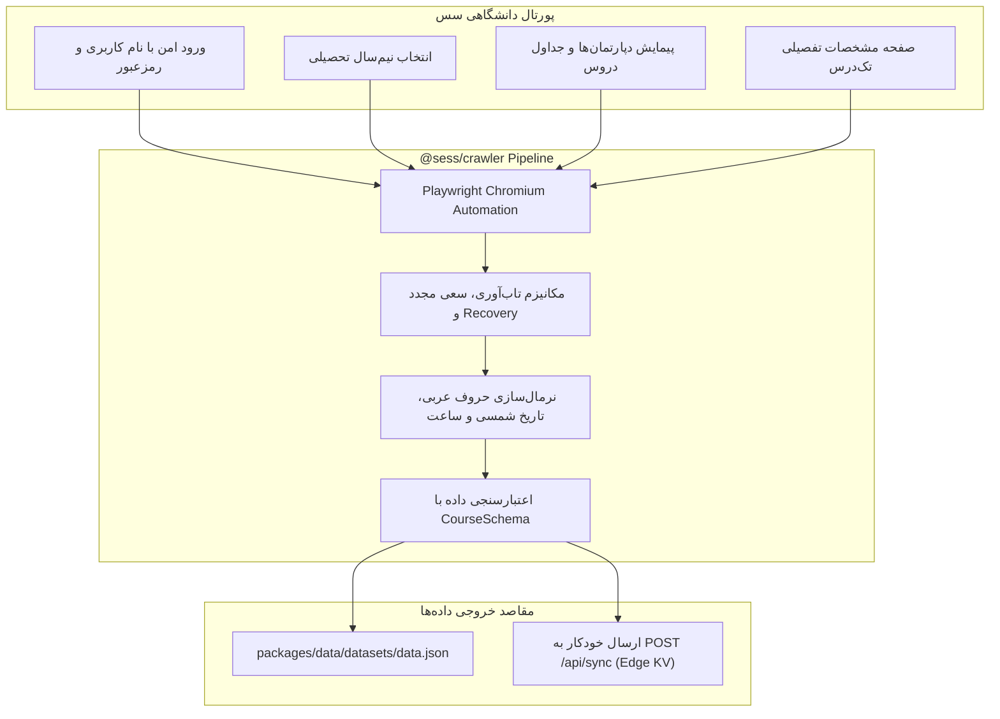

# سرویس کراولر پورتال سس (`@sess/crawler`)

سرویس `@sess/crawler` موتور اتوماسیون و خزنده اختصاصی پروژه برای ورود خودکار به پورتال‌های دانشگاهی مبتنی بر سیستم سس (**SESS - Shiraz University / Shahrekord University**)، واکشی کاتالوگ ارائه‌دروس ترمی، نرمال‌سازی متون و تاریخ‌های شمسی و اعتبارسنجی ۱۰۰٪ داده‌ها با `@sess/core` است.

این ابزار با استفاده از فریم‌ورک قدرتمند **Playwright** و زبان **TypeScript** نوشته شده و دارای رابط کاربری تعاملی خط فرمان (Interactive CLI Wizard) و همچنین مد تمام‌خودکار (Headless) برای خطوط لوله CI/CD است.

---

## ۱. معماری و ویژگی‌های فنی (Architecture & Pipeline)



### قابلیت‌های برجسته:
1. **Human-like Resilient Automation**: مدیریت کلیک‌های امن (`safeClick`) با ترکیب تعاملات استاندارد و اسکریپت‌های مستقیم DOM برای جلوگیری از باگ‌های منوهای کشویی و استیل المنت‌ها (Stale Elements).
2. **Auto-Recovery & Exponential Backoff**: بازیابی خودکار در صورت قطعی پورتال یا خطای شبکه با ۳ بار تلاش مجدد در هر مرحله.
3. **Advanced Parsing Engine (`parser.ts`)**:
   * یکسان‌سازی حروف و ارقام عربی/انگلیسی به فارسی استاندارد (`arabicToPersian`).
   * تفکیک متن ترکیبی فیلد زمان و مکان کلاس‌ها (مثلاً `"شنبه 10:00-12:00 (کلاس 101)"`) به ساختارهای مجزای `TimeSlot`.
   * استخراج ساختاریافته روز، ماه و سال تاریخ‌های امتحانات شمسی (`FinalDateSplit`) و بازه دقیق ساعت آزمون (`FinalTimeSplit`).
4. **Interactive CLI Wizard (`prompt.ts`)**: طراحی تجربه کاربری مدرن در خط فرمان به کمک کتابخانه محبوب `@clack/prompts`.

---

## ۲. پیکربندی و متغیرهای محیطی (Environment Configuration)

برای اجرای کراولر، فایل `.env` را در دایرکتوری `services/crawler/` ایجاد یا ویرایش کنید:

```ini
# آدرس پورتال سس دانشگاه (مثلاً دانشگاه شهرکرد)
SESS_URL=https://sess.sku.ac.ir

# نام کاربری و رمزعبور سامانه سس
SESS_USERNAME="s4011000000"
SESS_PASSWORD="your_secure_password"

# نیم‌سال پیش‌فرض (اختیاری - در صورت خالی بودن، آخرین نیم‌سال فعال انتخاب می‌شود)
SEMESTER="14051"

# لیست دپارتمان‌های خاص برای استخراج (با کاما تفکیک شود)
DEPARTMENTS="مهندسی کامپیوتر,بخش ریاضی,بخش فیزیک"

# کلید همگام‌سازی ابری API (اختیاری جهت ارسال مستقیم به Cloudflare)
SYNC_TOKEN=your_strong_api_sync_token
API_URL=https://your-domain.workers.dev/api/sync
```

---

## ۳. نحوه اجرا و دستورات خط فرمان (CLI Usage)

### الف) اجرای تعاملی (Interactive Wizard)
بهترین گزینه برای کاربران و توسعه‌دهندگان به صورت پرسش و پاسخ مرحله‌ای:

```bash
pnpm crawler:dev
```

در این محیط می‌توانید:
* نیم‌سال مورد نظر را از میان گزینه‌های موجود در پورتال انتخاب کنید.
* استخراج را برای تمامی دپارتمان‌ها یا یک دپارتمان خاص مشخص نمایید.
* حالت شبیه‌سازی (Dry Run) را برای تست ۲ دانشکده اول انتخاب کنید.

---

### ب) اجرای مستقیم با فلگ‌های خط فرمان (Command Line Flags)

مناسب برای اسکریپت‌های سروری خودکار (Cron Jobs / Github Actions):

```bash
# کراول یک دپارتمان خاص (بر اساس ایندکس) به صورت پس‌زمینه (Headless)
pnpm --filter @sess/crawler dev -- -d 32 --headless

# کراول کامل تمامی دانشکده‌های پورتال
pnpm --filter @sess/crawler dev -- --all --headless

# اجرای خزنده برای استخراج کامل بدون مرورگر و ذخیره در پکیج داده
pnpm --filter @sess/crawler dev -- --all --headless --output ./packages/data/datasets/data.json

# اجرای حالت تستی و اعتبارسنجی (Dry Run)
pnpm --filter @sess/crawler dev -- --dry-run
```

| فلگ | نام کامل | نوع | توضیحات |
| :--- | :--- | :--- | :--- |
| `-d` | `--department <idx>` | عدد | شماره ایندکس دپارتمان مورد نظر در پورتال |
| `-s` | `--semester <val>` | متن | کد یا متن نیم‌سال تحصیلی (مثلاً ۴۰۳۱) |
| `-a` | `--all` | بولین | استخراج اطلاعات تمام دپارتمان‌های ارائه شده |
| `-b` | `--browser <ch>` | متن | کانال مرورگر (`msedge`، `chrome` یا `chromium` پیش‌فرض Playwright) |
| `-o` | `--output <path>` | مسیر | مسیر ذخیره فایل نهایی `data.json` |
| `--headless` | `--headless` | بولین | اجرای مرورگر بدون باز شدن پنجره گرافیکی |
| `--sync` | `--sync` | بولین | ارسال خودکار داده‌ها به اندپوینت ابری `/api/sync` |
| `--dry-run` | `--dry-run` | بولین | اجرای آزمایشی روی ۲ دانشکده اول جهت تست |

---

## ۴. چرخه نرمال‌سازی و اعتبارسنجی (`parser.ts`)

هر سطر استخراج‌شده از جدول دوره‌ها مراحل زیر را طی می‌کند:

1. **خواندن فیلدهای خام فرم**: مقادیر المان‌های فرم سس (`edName`, `edTch`, `edTotalUnit`, `edTimeRoom` و غیره) واکشی می‌شوند.
2. **نرمال‌سازی متنی**: حروفی مثل `ك` و `ي` به `ک` و `ی` تبدیل شده و کاراکترهای اضافه حذف می‌گردند.
3. **تجزیه اسلات‌های زمانی**: تابع `seperateTimeAndPlace` زمان‌های چندگانه در هفته را به آرایه‌ای از تایم‌اسلات‌ها تبدیل می‌کند.
4. **اعتبارسنجی سخت‌گیرانه Zod**:
   ```typescript
   const parsedCourse = CourseSchema.parse(courseData);
   ```
   در صورت مغایرت تایپ‌ها یا ناقص بودن فیلدهای ضروری، فرآیند فوراً خطا داده و از ایجاد داده‌های نامعتبر جلوگیری به عمل می‌آید.

---

### خروجی کاتالوگ چندترم و همگام‌سازی ابری (`sync.ts`)
پس از تکمیل پردازش دوره‌ها:
1. **ساختاردهی UnifiedCatalog**: رکوردها بر اساس نیم‌سال تحصیلی (`--semester` یا ورودی پرامپت) در ساختار استاندارد چندترم قرار گرفته و متادیتای `updated_at` (بر اساس استاندارد زمان ISO) به آن افزوده می‌شود.
2. **ارسال امن به API**: تابع `syncToApi` با ارسال هدر `X-Semester` و توکن احراز هویت، داده‌ها را مستقیماً به اندپوینت `/api/sync` ارسال می‌کند.
3. **همگام‌سازی خودکار با فرانت‌اند**: فایل نهایی در مسیر کانونیکال `packages/data/datasets/data.json` ذخیره شده و یک نسخه از آن در دارایی‌های وب (`apps/web/public/data/data.json`) منعکس می‌گردد.

---

## ۵. تست‌های واحد و کامپایل برای پروداکشن

### تست‌های واحد
برای تست توابع پارسر، نرمال‌سازی تاریخ و ساعت بدون نیاز به باز کردن مرورگر:
```bash
pnpm --filter @sess/crawler test
```

### کامپایل و اجرای باینری نهایی
```bash
# کامپایل کدهای کراولر با tsup
pnpm crawler:build

# اجرای نسخه کامپایل‌شده نهایی
pnpm crawler:start
```
