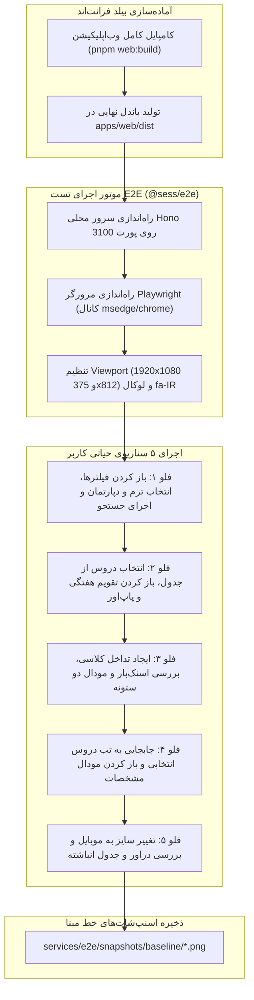

# سوئیت تست‌های رگرسیون بصری E2E (`@sess/e2e`)

پکیج `@sess/e2e` وظیفه تضمین کیفیت بصری و تست‌های سرتاسری (End-to-End Visual Regression) را در سراسر چرخه نوسازی و ارتقای پروژه بر عهده دارد. این سوئیت با استفاده از فریم‌ورک قدرتمند **Playwright**، اجرای خودکار مرورگرهای مبتنی بر هسته کرومیوم ( نظیر Microsoft Edge و Google Chrome) و تصویربرداری در سطح پیکسل (Pixel-Perfect Baselines)، تضمین می‌کند که هیچ تغییری در کدهای فرانت‌اند یا بیزینس لاجیک باعث به‌هم‌ریختگی ظاهری، شکستگی استایل‌ها یا خطای رندر در تایپوگرافی راست‌به‌چپ (RTL) نشود.

---

## ۱. معماری و خط لوله اعتبارسنجی (Visual Safety Net)

در طول مهاجرت‌های معماری و بازنویسی کامپوننت‌ها، تست‌های واحد کد به تنهایی قادر به تشخیص جابجایی پیکسل‌ها، خرابی انیمیشن‌ها یا پنهان شدن المنتی در لایه‌های CSS نیستند. سوئیت `@sess/e2e` به عنوان یک «تور ایمنی بصری» عمل می‌کند:



---

## ۲. فهرست اسنپ‌شات‌های خط مبنا (Baseline Snapshots)

تصاویر ثبت‌شده در دایرکتوری `services/e2e/snapshots/baseline/` به عنوان مرجع قطعی سنجش تغییرات ظاهری نگهداری می‌شوند:

| نام فایل اسنپ‌شات | ابعاد نمایشی (Viewport) | سناریوی مورد سنجش |
| :--- | :--- | :--- |
| `01_search_results_desktop.png` | 1920×1080 | نمایش دسکتاپ جدول دروس، صفحه‌بندی (Pagination)، فیلترهای اعمال‌شده و چیپ‌های وضعیت |
| `02_calendar_schedule.png` | 1920×1080 | چیدمان تقویم هفتگی ایرانی (شنبه تا جمعه)، کارت‌های زمانی دروس و هم‌پوشانی‌ها |
| `02_calendar_event_popover.png` | 1920×1080 | باز شدن پاپ‌اور شناور مشخصات درس هنگام کلیک روی رویداد تقویم |
| `03_clash_snackbar_and_modal.png` | 1920×1080 | فعال‌سازی اسنک‌بار قرمز هشدار تداخل و باز شدن مودال مقایسه ساید-بای-ساید دو ستونه |
| `04_course_details_modal.png` | 1920×1080 | دیالوگ مشخصات تفصیلی، ظرفیت، ساعات امتحان و اساتید از درون تب دروس انتخابی |
| `05_mobile_drawer.png` | 375×812 | چیدمان واکنش‌گرای دراور و فیلترها در صفحات نمایش کوچک موبایل |
| `05_mobile_table_stacked.png` | 375×812 | کارت‌های انباشته و چیدمان بدون اسکرول افقی خراب در جدول اطلاعات دروس موبایل |

---

## ۳. نحوه کارکرد اسکریپت `capture_baseline.ts`

این اسکریپت مراحل زیر را با دقت بالا پیاده‌سازی می‌کند:

1. **اعتبارسنجی خروجی بیلد**: مسیر فایل‌های کامپایل‌شده فرانت‌اند با تابع `resolveWebDistPath()` بررسی شده و در صورت نبود `apps/web/dist/index.html`، پیام راهنمای مناسب به توسعه‌دهنده داده می‌شود.
2. **سرویس‌دهی ایزوله پروداکشن**: سرور مستقل Hono بر روی پورت موقت ۳۱۰۰ راه‌اندازی شده و فایل‌های استاتیک را سرویس‌دهی می‌کند.
3. **شبیه‌سازی مرورگر واقعی**: مرورگر Playwright در کانال اختصاصی `msedge` (یا کروم محلی سیستم) با لوکال زبان فارسی (`fa-IR`) راه‌اندازی می‌گردد.
4. **شبیه‌سازی رفتار طبیعی کاربر**: توالی‌های کلیک، پر کردن فیلدهای کشویی، کلیک روی چک‌باکس‌ها و باز کردن مودال‌ها با تاخیرهای دقیق جهت هیدریشن کامل Vue و فونت‌ها انجام می‌پذیرد.
5. **تصویربرداری و توقف ایمن**: تمامی اسنپ‌شات‌ها ذخیره شده و پس از پایان، سرور و مرورگر به صورت ایمن بسته می‌شوند.

---

## ۴. نحوه اجرا و دستورات خط فرمان

> [!IMPORTANT]
> قبل از اجرای تست رگرسیون تصویری، حتماً پروژه وب را یک بار بیلد کنید:
> ```bash
> pnpm web:build
> ```

```bash
# اجرای فرآیند ثبت و اعتبارسنجی خط مبنا
pnpm e2e:baseline

# یا با استفاده از فیلتر مستقیم پکیج:
pnpm --filter @sess/e2e test
```

---

## ۵. تحلیل نتایج و بررسی رگرسیون

* اگر در تغییرات ظاهری، استایلی جابجا شود یا فونت‌ها به درستی لود نگردند، فایل‌های جدید با اسنپ‌شات‌های مرجع مقایسه شده و عدم تطابق‌ها فورا مشخص می‌گردد.
* این سوئیت موفق شد در طول انتقال کامل از Vue 2 به Vue 3.5 و Vuetify 3، حفظ ۱۰۰٪ چیدمان و ساختار بصری رابط کاربری را تضمین کند.
